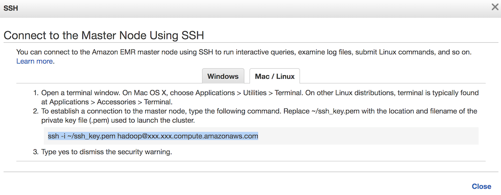

# AWS EMR with MySQL, PostgreSQL support and S3 Storage #

## Prerequisites ##

1. AWS account

1. [AWS CLI](https://aws.amazon.com/cli/)

1. Some knowledge about VPC, EC2 and CloudFormation.

---

## Usage Guide ##

1. Create an EMR cluster in AWS.

    A sample template is attached in this repo. It creates a cluster with most options pre-configured.

    1. Visit [AWS CloudFormation Console](https://console.aws.amazon.com/cloudformation).

    1. Click **Create Stack**.

    1. Choose **Upload a template to Amazon S3** and select the `cloudformation.yml` in this directory.

    1. Fill in the parameters and create the stack. Wait for it to complete.

1. SSH into master node

    1. Visit [AWS EMR Console](https://console.aws.amazon.com/elasticmapreduce) and click into the cluster just created.

    1. Click **SSH** right after **Master public DNS**.

    1. Use the command in the popup

    

    If you see the ASCII art for "EMR", then congrats :)

    1. Otherwise, check to see if you have setup Master node's security group to allow access from your local.

    And that you have the correct key file to SSH into the instance.

1. Run the customization on EMR master node

    ```sh
    # Download the drivers for JDBC
    wget http://central.maven.org/maven2/org/postgresql/postgresql/42.2.2/postgresql-42.2.2.jar -O /home/hadoop/postgresql.jar
    wget http://central.maven.org/maven2/mysql/mysql-connector-java/8.0.11/mysql-connector-java-8.0.11.jar -O /home/hadoop/mysql.jar

    # Overwrite the config files in
    # 1. /etc/zeppelin/conf/interpreter.json
    # 2. /etc/zeppelin/conf/zeppelin-env.sh
    #
    # Using the file in this directory.
    # Remember to fill in the ZEPPELIN_NOTEBOOK_S3_BUCKET in zeppelin-env.sh

    # Restart Zeppelin to take effect
    sudo stop zeppelin
    sudo start zeppelin
    ```

1. Visit Zeppelin by http://<EMR_endpoint>:8890

1. Terminate the cluster when done to save cost :)

---

## Some Notes about Deploying to Production ##

While we have successfully automated the notebooks in production, readers who refer to this guide should take extra steps in order to deploy.

Your mileage may vary, but we provide the following suggestions.

### Automate the customizations ###

If the EMR cluster is planned to be long running, then one-time setup maybe fine.

Otherwise, automating the customization should be considered, for example:

1. Prepare a bootstrap script to download drivers and update the config files.

1. Adding a step in EMR to execute the script. e.g. in `cloudformation.yml`, add one more resource:

    ```
    EmrConfigStep:
      Type: "AWS::EMR::Step"
      Properties:
        ActionOnFailure: "TERMINATE_CLUSTER"
        HadoopJarStep:
          Jar: "s3://region.elasticmapreduce/libs/script-runner/script-runner.jar"
          Args:
            - "s3://path/to/config/script"
        JobFlowId: !Ref EmrCluster
        Name: "EmrConfigStep"
    ```

### Automate the execution of notebooks ###

Zeppelin notebooks can be scheduled using its [built-in cron](https://zeppelin.apache.org/docs/0.8.0-SNAPSHOT/usage/other_features/cron_scheduler.html).

Moreover, it's possible to use [REST API](https://zeppelin.apache.org/docs/0.7.3/rest-api/rest-notebook.html) to run the notebooks programmatically.

Some notes on running notebooks:

1. You may define input parameters in the notebooks like:

    ```python
    start_date = z.input("start_date")
    end_date = z.input("end_date")
    # Process data between the input date range
    ```

    More on input parameters in [Zeppelin documentation](https://zeppelin.apache.org/docs/0.7.3/manual/dynamicform.html).

2. To run notebook with parameters, you need to run that one paragraph by the REST API, e.g.

    ```python
    import requests
    import json
    res = requests.post(
      "http://<EMR_endpoint>:8890/api/notebook/job/<notebook_id>/<paragraph_id>",
      data=json.dumps({
        "params": {
          "start_date": "2018-06-01",
          "end_date": "2018-06-02"
        }
      })
    )
    res.raise_for_status()
    ```
